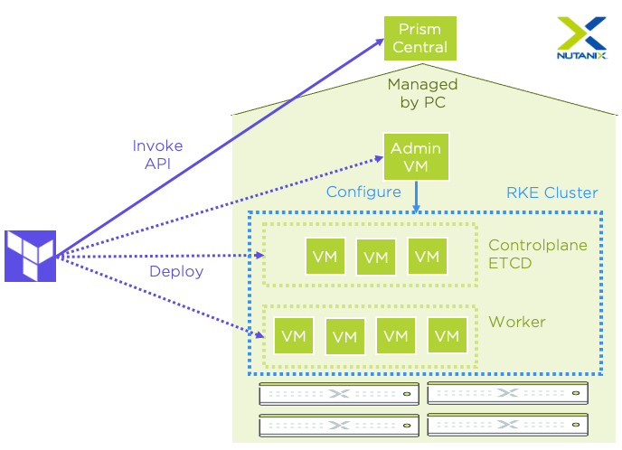

# Deploy Rancher RKE Kubernetes clusters on Nutanix AHV using Terraform
**Note:** This is not a Nutanix supported repository.
## Overview
In following Git repo you can find the code to deploy a Rancher RKE cluster on top of AHV using Terraform:

https://github.com/yannickstruyf3/rke-on-ahv

It will also automatically install the Nutanix CSI driver allowing Persistent Volumes to be created on top of the RKE cluster.
Current functionality is present in the code:
- Deploy RKE cluster
- Add RKE worker nodes
- Delete RKE worker nodes (force-removal of nodes, to be modified in future versions)
- Delete RKE cluster

All commands documented below should be executed from the `terraform` folder.

More information on Rancher RKE can be found here: https://rancher.com/docs/rke/latest/en/

## Requirements
- Prism Central Admin credentials
- Prism Element Admin credentials
- Terraform (version > 0.13.x)
- Internet access for image download
- Kubectl (for automated tests)
- Golang (for automated tests)

## Architecture



Terraform will deploy 6 AHV virtual machines based on CentOS 8 by default:
- 1 Admin VM
- 3 VMs with `etcd` and `controlplane` role
- 2 VMs with `worker` role

**Note:** A CentOS 8 image will be uploaded automatically

The Admin VM is used for deploying and configuring RKE on top of the controlplane and worker VMs. All RKE configuration parameters are contained in a single `cluster.yml` file. Terraform will create the `cluster.yml` file based on the `cluster.yml.tpl` template file located in the `terraform/templates` directory.  
After deployment the parsed file can be found in the `/home/nutanix` folder on the Admin VM. All RKE CLI commands will be executed on this VM.

Terraform will generate a new SSH-keypair and write it to the local filesystem in the format of `rke_<rke_cluster_name>` and `rke_<rke_cluster_name>.pub`. This keypair can be used to login on each of the RKE VMs using following command:
```
ssh -i <ssh_private_key_path> nutanix@<rke_vm_ip>
```

## Deploying the RKE cluster
First step is to create a `terraform.tfvars` file in the `terraform` directory. It is possible to use the `terraform.tfvars.example` file as a starting point. 
Modifying the `amount_of_rke_worker_vms` parameter to a higher or lower number will result in a scale-up or scale-down of the RKE cluster.

After creating the `terraform.tfvars` file the cluster can be created. Use the default Terraform commands to start deployment:
```
terraform init
terraform plan
terraform apply
```

After deployment Terraform will fetch the `kubeconfig` file from the Admin vm. This file will be named `kube_config_cluster.yml`.

The cluster can be accessed by using the `KUBECONFIG` environment variable:
```
export KUBECONFIG="kube_config_cluster.yml"
```

Destroying the cluster can be performed with following command:
```
terraform destroy
```

## Tweaking RKE cluster deployment
The resources (CPUs, sockets, memory, storage,...) of the to-be-deployed virtual machines can be modified by overwriting following Terraform variables in the `terraform.tfvars` file: 
- `rke_control_vm_config`
- `rke_admin_vm_config`
- `rke_worker_vm_config`

The `terraform/templates/cluster.yml.tpl` can be modified to add more RKE configuration parameters. Check following link for examples: https://rancher.com/docs/rke/latest/en/example-yamls/

## Running tests
The Git repository also contains automated tests based on Terratest. These tests are located in the `terraform/test` directory.

Following tests are implemented:
- TestTerraform_RKE_CreateCluster
- TestTerraform_RKE_CreateClusterMultipleWorkerNodes
- TestTerraform_RKE_ClusterScaling

Tests can be started with following command:
```
go test -v -timeout 0  --run "TestTerraform_RKE_"
```

For more information on Terratest visit: 